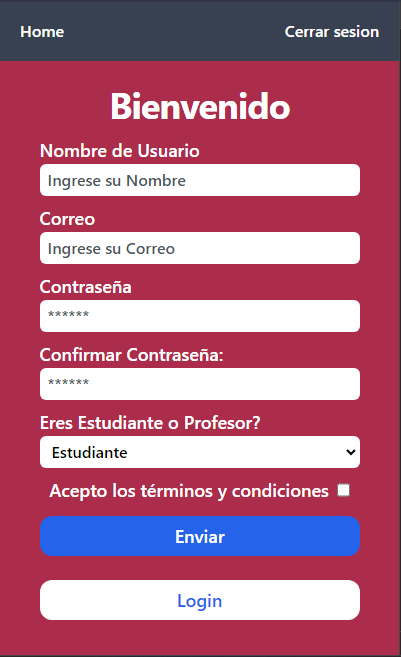

# FULLStack WebApplication build with NESTJS and Reactjs
- In this project I build a server with Nestjs, with Authentication based on JWT with Prisma and MongoDB. Also I build a frontend with Reactjs and Tailwindcss.

## Screenshot
Register Responsive

