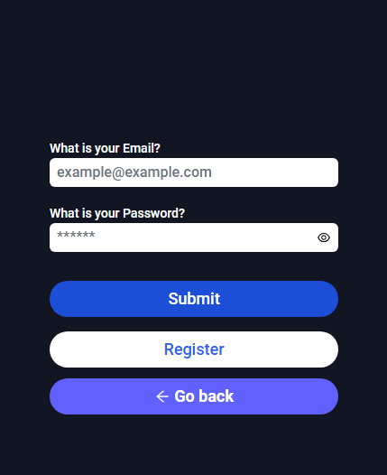
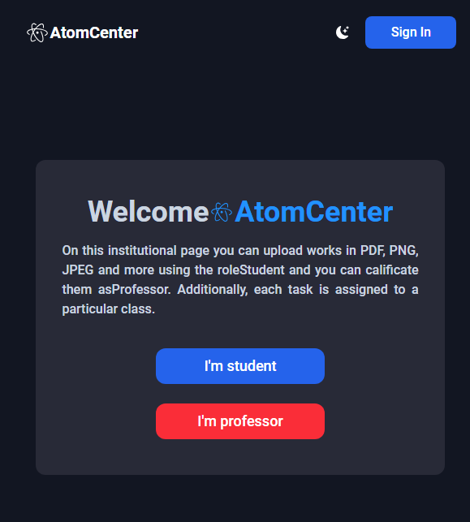

# FULLStack WebApplication build with NESTJS and Reactjs
- In this project I build a server with Nestjs, with Authentication based on JWT with Prisma and PostgreSQL. Also I build a frontend with Reactjs and Tailwindcss.

- For the store I implement zustand to persist some data like names and email, to be available to send some data to server, the zustand code is in the store folder.

- For the forms I ussed React Hook Form with Typescript

- I use Tanstack query with axios to get,delete, post and update the data with the Api

## Screenshot
Login screenshot

Home page

